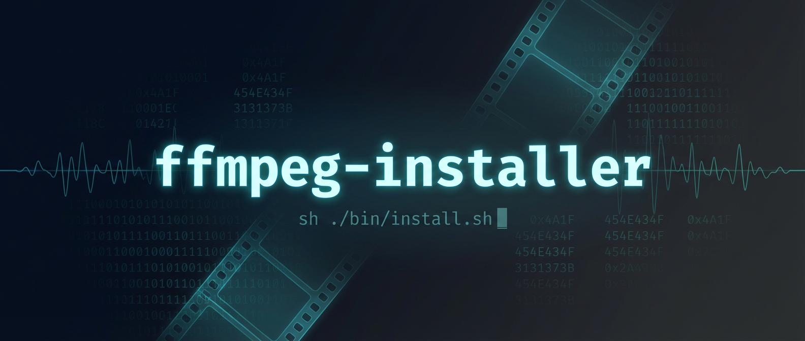
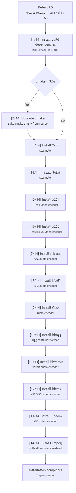
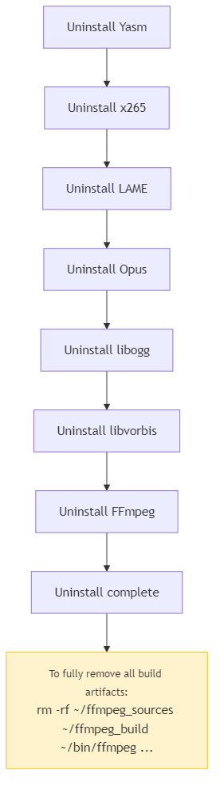

<p align="center">
  
</p>

<p align="center">
  One-command FFmpeg build from source — installs x264, x265, VP9, AV1, AAC, MP3 and more on CentOS, Amazon Linux, Ubuntu and beyond.
</p>

<p align="center">
  <a href="LICENSE"></a>
  
  
</p>

## What's Inside

This installer builds FFmpeg from source with the following encoders enabled:

| Encoder | Format | Type |
|---------|--------|------|
| x264 | H.264 | Video |
| x265 | H.265 / HEVC | Video |
| libvpx | VP8 / VP9 | Video |
| libaom | AV1 | Video |
| fdk-aac | AAC | Audio |
| LAME | MP3 | Audio |
| Opus | Opus | Audio |
| Vorbis | Vorbis | Audio |

All libraries are built as **static** and installed to `~/ffmpeg_build`.
The `ffmpeg` binary is installed to `~/bin`.

> Based on the [official FFmpeg compilation guide for CentOS](https://trac.ffmpeg.org/wiki/CompilationGuide/Centos).

## Supported Platforms

| Distro | Package Manager |
|--------|----------------|
| CentOS / RHEL | yum |
| Rocky / AlmaLinux / Amazon Linux / Fedora | dnf |
| Ubuntu / Debian | apt |

The installer auto-detects your OS via `/etc/os-release` and uses the correct package manager.

## Prerequisites

- One of the supported platforms above
- cmake 3.5+ (automatically upgraded by the installer if below 3.5)

## Quick Start

### Install

```sh
chmod +x ./bin/install.sh
./bin/install.sh
```



### Uninstall

```sh
chmod +x ./bin/uninstall.sh
./bin/uninstall.sh
```



## FFmpeg Command Examples

### Video to Sequential Images

```sh
ffmpeg -i input.mp4 -vf fps=1 output_%04d.png
```

### Sequential Images to MP4

```sh
ffmpeg -framerate 1 -i input_%04d.png -vcodec libx264 -pix_fmt yuv420p -r 60 output.mp4
```

| Parameter | Description |
|-----------|-------------|
| `-framerate` | Input frame rate (images per second) |
| `-r` | Output frame rate |
| `-vcodec libx264` | H.264 encoder |
| `-pix_fmt yuv420p` | Pixel format for broad compatibility |

### Sequential Images to GIF

```sh
ffmpeg -framerate 1 -i input_%04d.png -r 60 -vf scale=512:-1 output.gif
```

| Parameter | Description |
|-----------|-------------|
| `-vf scale=512:-1` | Scale width to 512px, maintain aspect ratio. Omit for original size |

## Node.js Examples

Using [ffmpeg-stream](https://www.npmjs.com/package/ffmpeg-stream):

```sh
cd examples
npm install
node images2mp4.js
node images2gif.js
```

| Description | File |
|-------------|------|
| Images to MP4 | [examples/images2mp4.js](examples/images2mp4.js) |
| Images to GIF | [examples/images2gif.js](examples/images2gif.js) |

## Changelog

See [CHANGELOG.md](CHANGELOG.md) for release history.

## License

MIT — see [LICENSE](LICENSE).

## Author

- X: [@shumatsumonobu](https://x.com/shumatsumonobu)
- GitHub: [shumatsumonobu](https://github.com/shumatsumonobu)
- Email: shumatsumonobu@gmail.com
